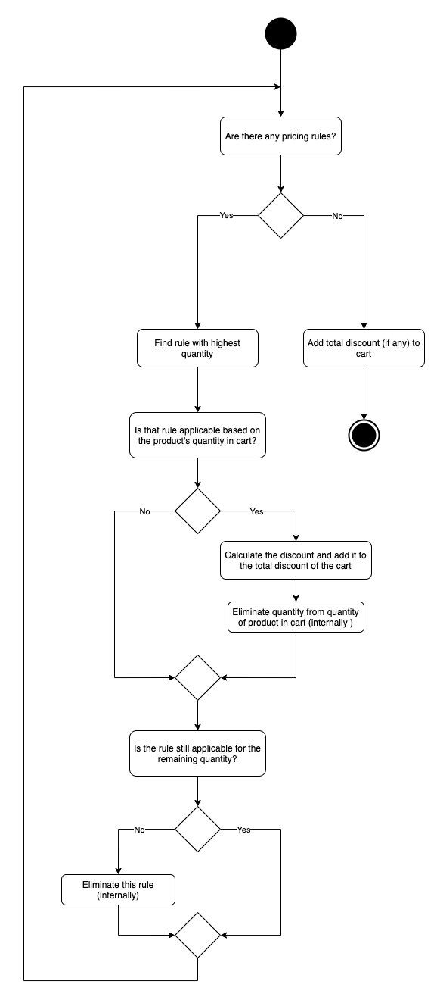

# Supermarket Checkout
## Introduction
A system that handles the checkout process for supermarkets and is extensible to support different kinds of offers. 

## Requirements
- PHP 8+
- Composer
- Docker & docker-compose
- WSL2 (for Windows)

## Setup
- Create the environment file, you may copy the existing example by running `cp .env.example .env`
- Install dependencies by running `composer install`
- Run `alias sail='bash vendor/bin/sail'` to avoid calling Sail with its full vendor path on each command
- Start Sail to build and run the docker container `sail up -d`
- Generate a new application key by running `sail artisan key:generate`
- For the development environment, you may want to seed the database, run `sail artisan migrate:fresh --seed`

## Testing
The project was built using TDD practices, To run all tests: `sail artisan test`

## Usage & Functional features
There's are two functionality for the system, which are scanning products to be:
  - Added to cart, if no cart is specified, a new cart will be automatically opened.
  - Removed from cart.

When creating a new cart, the system will respond with the cart_id, it should be used in next requests related to this checkout transaction.

Examples of each request can be found in this [Postman collection](readme_assets/Supermarket Checkout.postman_collection.json) , make sure to run the seeders first!

## Non-Functional Features
### Code flexibility
There are two main criteria in the system that need to be flexible,
- **Storage engine** -since it isn't mentioned in the requirements- is easily swappable thanks to centralizing database calls in Repositories, the current implementation is built for MySQL/MariaDB.
- **Offers' logic** -as supermarkets provide different kind of offers- is open to extension
  - Offers calculations are isolated in Strategies, we can easily add offers without modifying the code base, instead only adding a strategy class for it.
  - The logic of offers is vastly flexible, offers of a specific product can optionally access that product, other products in cart, cart's information, and even the other valid offers.
  - Multiple offers can easily work side by side, or applied multiple times on the same product, since their responsibility is to optionally increase the cart's discount, so, also, if an offer does not provide a discount (maybe instead, the customer wins DevolonCoin?) that's also possible.
    
### Scalability
- The use of caching on offers (of carts) allows the system to handle many offers without affecting performance.
- Adding another layer of caching for applied offers to avoid going through cached offers for filtering repeatedly.
- Cached entries can be flushed when there's no further use for them.

### Fault-Tolerance
- Caching service failure, which leads to losing in that case the system picks the offers up from db and caches them again.
- Atomic transactions used on all methods that has multiple-queries to avoid having corrupt data.

## Business Requirements
### Operation Friendliness
- Creating a cart is done automatically when scanning a product.
- Adding multiple items of the same product doesn't require scanning multiple times, instead the system accepts a Quantity parameter.
- Support for removing products from cart, also accepts a Quantity parameter.

### Multiple same product rules
The offer type mentioned in the requirement is implemented a logic that can be summarized as:

_apply all rules of all offers applicable to the product's quantity, with priority to the highest rule, and allows the same rule to be repeated as many times as possible._

So the steps go down as follows:

## Next Steps
To stick with the scope of the requirements, certain features are not implemented but they might be needed:
- Endpoints to close the cart (as finished or canceled), they must take advantage of the `flushOffersCache` in `Cart` model.
- Endpoints to control Products, Carts and Offers.
- Duration for offers.
